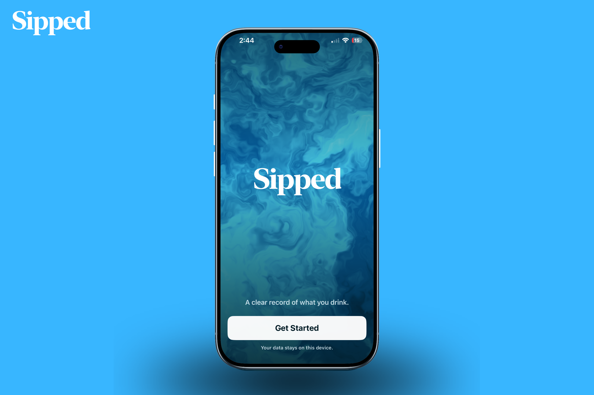

&nbsp;&nbsp;&nbsp;

<strong>A private drink diary that records what you had, without judging what you chose.</strong>

Created for the Codex Build Week hackathon.

Sipped is an iPhone app for keeping a clear record of what you drink. Pick a drink, choose the container it came in, drag the liquid to the amount you consumed, and save it. Sipped keeps track of fluid, caffeine, sugar, and alcohol in one place.

You can choose a neutral daily fluid goal used only as the fixed 100% scale in History. There are no coaching messages, recommendations, reminders, streaks, scores, or guesses about what is happening inside your body. It is simply a useful record that stays on your phone.

## How it works

1. Choose from a visual library of familiar drinks, recent drinks, or your own saved drinks.
2. Pick a suitable container, with capacities and shapes that make sense for that drink.
3. Drag upward on the vessel to set the amount. Every new entry starts empty, and exact number entry is available too.
4. Confirm once to add the drink to Today.

Sipped remembers the container you last used for a saved drink, but it never carries the previous amount into a new entry.

## What you can see

- A Today view with totals for fluid, caffeine, sugar, and alcohol
- A graph showing how the selected measure changed with each drink
- An interactive seven-day history with a configurable fluid scale and selected-day inspector
- Searchable drink and container libraries with original vessel artwork
- Custom drinks and containers for the things you use regularly
- Clear calculation notes on each entry, including raw alcohol inputs where relevant
- Regional standard drink calculations for Australia, the United States, the United Kingdom, and Canada

Fluid means the literal amount consumed. Caffeine is shown as cumulative intake. Sugar includes inherent and added sugar. Alcohol is derived from the recorded volume and ABV using the selected regional standard.

## Built for Codex Build Week

Sipped was created for the Codex Build Week hackathon as a complete native iOS project. The work began with a written product model and a visual reference contract, then moved through implementation, catalogue design, interaction testing, accessibility checks, and acceptance tests.

The result is intentionally focused. It explores whether logging a drink can be fast, visual, transparent, and private without turning the record into a score.

## How Codex and GPT-5.6 were used

Codex, powered by GPT-5.6, was used as the primary engineering partner throughout the build. The model helped turn the product idea into a concrete domain model, implementation plan, SwiftUI views, SwiftData persistence, original vessel artwork, and focused test coverage.

The collaboration was deliberately iterative:

- **Product reasoning:** Codex helped clarify the vocabulary and invariants behind Sipped, including immutable `DrinkLog` snapshots, zero-start amounts, literal fluid totals, regional alcohol standards, and local-only persistence.
- **Implementation:** GPT-5.6 generated and refined the native iOS architecture across the domain, catalogue, logging flow, Today, History, Library, settings, and design-system layers.
- **Visual design:** Codex helped translate the visual reference contract into an original illustration grammar for drinks and containers, including clipped liquid, vessel silhouettes, surface bands, particles, and Reduce Motion behaviour.
- **Quality loop:** The model used repository context and test feedback to iterate on edge cases, accessibility identifiers, Dynamic Type and VoiceOver considerations, interaction states, catalogue compatibility, and XCTest/XCUITest acceptance flows.

The human role stayed central: defining the product boundaries, reviewing each change, choosing the final interaction and visual direction, and deciding what Sipped should—and should not—do. Codex and GPT-5.6 accelerated the path from those decisions to a coherent, testable app while keeping the work inspectable in the repository.

## For developers

### Stack

- Swift 5
- SwiftUI for the interface
- SwiftData for local persistence
- Swift Charts for Today and History
- XCTest and XCUITest for unit and acceptance coverage
- iOS 17 minimum deployment target
- No third-party runtime dependencies

### Architecture

Sipped is a local snapshot ledger. Reusable drink and container definitions can change, while each `DrinkLog` keeps the values needed to preserve its own history.

The calculation layer is separate from presentation code. Tests can inject a fixed date, region, catalogue, and memory-only data store, which keeps results deterministic.

The main persisted models are:

- `DrinkDefinition`: reusable drink identity and calculation basis
- `ContainerDefinition`: vessel name, capacity, artwork, and compatible categories
- `DrinkUsagePreference`: the last container used for a saved drink
- `DrinkLog`: a historical snapshot of the consumed amount and its contributions
- `UserPreferences`: units, daily fluid goal, category order, appearance, selected measure, and alcohol standard

The product vocabulary and invariants live in [`CONTEXT.md`](CONTEXT.md).

### Repository guide

| Path                                                 | Purpose                                                                       |
| ---------------------------------------------------- | ----------------------------------------------------------------------------- |
| `Sipped/Domain.swift`                                | SwiftData models, amount math, contribution calculations, and daily totals    |
| `Sipped/Catalog.swift`                               | Built-in drink and container reference data, seeding, and catalogue migration |
| `Sipped/LoggingFlowView.swift`                       | Drink, container, and amount stages of the logging flow                       |
| `Sipped/TodayView.swift`                             | Current-day totals, chart, entries, delete, and undo                          |
| `Sipped/HistoryView.swift`                           | Seven-day chart and day detail views                                          |
| `Sipped/LibraryView.swift`                           | Drink, saved drink, and grouped container galleries                           |
| `Sipped/VesselArtwork.swift`                         | Original vessel shapes, clipped liquid, surface bands, and particles          |
| `Sipped/DesignSystem.swift`                          | Shared colours, controls, cards, formatters, and layouts                      |
| `Sipped/AppEnvironment.swift`                        | Date, calendar, region, and deterministic test inputs                         |
| `SippedTests/`                                       | Calculator, amount math, catalogue, compatibility, and migration tests        |
| `SippedUITests/`                                     | Full product-flow and accessibility acceptance tests                          |
