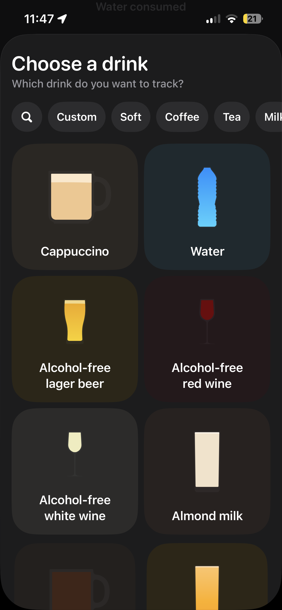
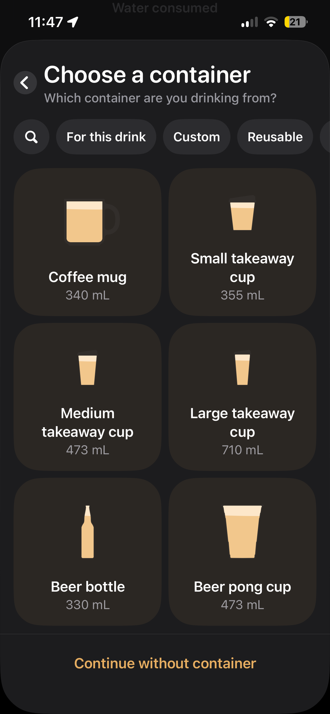
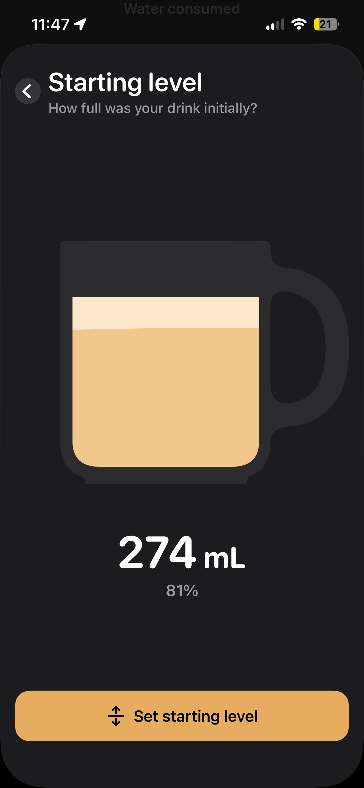
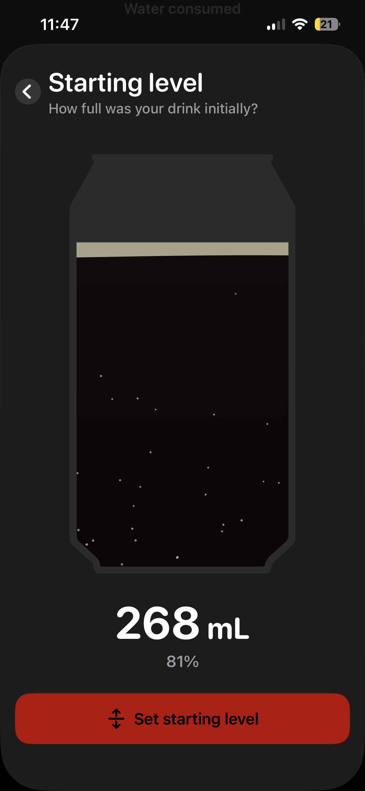
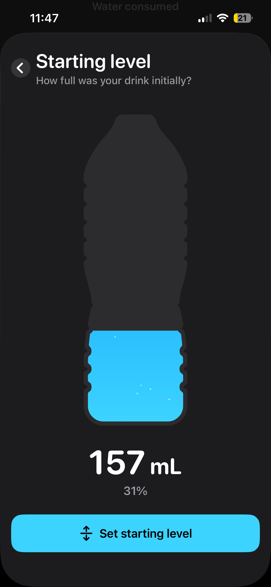

# Sipped Visual Reference Contract

These screenshots are product references for the Sipped iPhone app. They were captured by the product owner from a live iOS beverage-tracking workflow on 15 July 2026.

The images explain the required quality, hierarchy, and breadth of the library experience. They are not assets to ship and are not permission to reproduce the source app's exact layouts, illustrations, colours, typography, icons, or branding.

## Reference priority

1. The drink library is the highest-priority reference.
2. The compatible container library is the second-highest-priority reference.
3. The fill screens demonstrate the relationship between vessel shape, liquid appearance, amount, percentage, and primary action.
4. The Sipped PRD remains authoritative whenever the reference behaviour conflicts with the product decisions.

## Drink library

Use this screenshot to understand:

- A library should feel visual and browsable, not like a settings list.
- Search and category filters remain visible above the catalogue.
- A two-column grid gives each drink enough space for an immediately recognisable illustration and a readable name.
- Cards can use restrained category-tinted surfaces to make a large catalogue easier to scan.
- Drink artwork should communicate both the beverage and a plausible serving vessel.
- Generic drink names are preferable to branded menu items.
- The catalogue should remain useful when it contains many categories.

Apply these ideas to Sipped as follows:

- The first logging stage includes My Drinks, Recents, search, and the full generic library.
- Category pills personalise and filter ordering but never hide unselected categories permanently.
- Use an adaptive two-column phone grid with consistent card heights and a clear selected or pressed state.
- Each card includes original drink artwork and a concise drink name. Secondary values should appear only when they help selection.
- Coffee, tea, water, juice, milk, soft drinks, energy drinks, smoothies, kombucha, beer, wine, spirits, and custom drinks must feel like one coherent library.
- Dynamic Type must not cause drink names to overlap artwork or neighbouring cards.
- The library is a core product surface and must not be replaced by a plain list or a small row of recent drinks.

## Compatible container library

Use this screenshot to understand:

- Container selection benefits from the same large, visual two-column gallery as drink selection.
- Each container card needs an unmistakable silhouette, a name, and its capacity.
- A compatibility filter such as “For this drink” keeps the first choices plausible.
- Search, custom vessels, and broader container groups can remain available without crowding the default set.
- Repeated card structure makes differences between capacities and shapes easy to compare.

Apply these ideas to Sipped as follows:

- Show at least four category-appropriate containers for every drink category.
- Default to compatible containers for the selected drink.
- Coffee should prioritise espresso cups, mugs, takeaway cups, and iced glasses.
- Beer should prioritise bottles, cans, schooners, pints, and steins.
- Wine, spirits, water, juice, soft drinks, and other categories need similarly credible defaults.
- Keep implausible combinations out of the primary set, such as coffee in a pint or beer in a coffee mug.
- A More Containers route may expose unusual compatible options.
- Custom containers include a name and capacity while using Sipped's original vessel system.
- Remember the last container used for a saved drink, but never remember its previous fill amount.

## Fill interaction

### Coffee mug

### Can

### Water bottle

Use these screenshots to understand:

- The chosen vessel becomes the dominant object on the amount screen.
- Liquid is clipped convincingly to the vessel silhouette.
- Beverage colour, foam, bubbles, and other restrained details can distinguish liquids without requiring photorealism.
- Millilitres and percentage update together and remain easy to read.
- The primary action inherits the beverage's visual identity without compromising label contrast.
- Different silhouettes must remain legible at a large scale.

Sipped intentionally changes the interaction:

- Do not ask for a starting level.
- Do not begin with a partially or fully filled vessel.
- Every new log begins at zero.
- The user drags upward from the bottom of the vessel to specify the amount consumed.
- Show live volume and all four projected contributions while the fill changes.
- Provide subtle haptic snap points at 25, 50, 75, and 100 percent.
- Provide a visible numeric-entry alternative so the drag gesture is never the only way to set an amount.
- Confirming the amount logs the drink immediately. There is no review stage.

## Originality requirements

- Create an original Sipped illustration system for drinks and containers.
- Do not trace or reuse reference artwork.
- Do not reproduce the source app's exact card geometry, spacing, type scale, colour values, navigation, or button treatment.
- Preserve native iOS behaviour, 44-point minimum touch targets, Dynamic Type, VoiceOver labelling, sufficient contrast, and Reduce Motion support.
- Use the references to match the level of care and catalogue clarity, not the brand expression.

